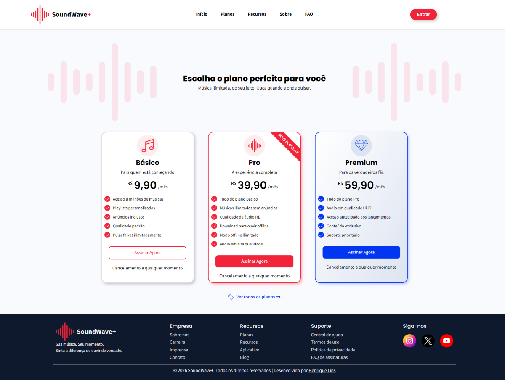

# 🎵 SoundWave+

> **Escolha como você quer ouvir.**

O **SoundWave+** é uma plataforma fictícia de streaming de música independente, desenvolvida para apresentar diferentes opções de assinatura em uma interface simples, moderna e responsiva.

---

## 📸 Preview



---

## 🌐 Projeto Online

🔗 **Acesse o projeto:** [Visualizar Projeto](https://henrique-aragao.github.io/soundwave_pricing_cards/)

---

## 🎧 Planos

A página apresenta três opções de assinatura:

- 🔴 **Básico** — recursos essenciais para começar.
- ⭐ **Pro** — plano recomendado, com equilíbrio entre preço e benefícios.
- 🔵 **Premium** — experiência mais completa da plataforma.

Cada plano apresenta seu preço em destaque, lista de benefícios e botão de assinatura.

---

## 🎨 Interface

A identidade visual combina **vermelho, azul e tons neutros**, criando uma interface moderna e mantendo uma boa experiência de leitura.

- **Poppins** para títulos e elementos de destaque.
- **Source Sans 3** para textos.
- Destaque visual para o plano **Pro**.
- Efeitos de interação nos cards e botões.
- Variáveis CSS para organização de cores, espaçamentos, bordas e sombras.

---

## 📱 Responsividade

O layout foi adaptado para diferentes tamanhos de tela:

- 💻 **Desktop:** 3 cards por linha.
- 📲 **Tablet:** 2 cards por linha.
- 📱 **Celular:** 1 card por linha.

---

## 🛠️ Tecnologias

- HTML5
- CSS3
- CSS Grid
- Flexbox
- Media Queries
- CSS Variables
- Google Fonts

---

## 📂 Estrutura do Projeto

```text
📦 SoundWave+
│
├── assets/
│   ├── css/
│   │   ├── style.css
│   │   └── responsivo.css
│   │
│   ├── icons/
│   └── img/
│
├── preview/
│   └── preview.png
│
├── index.html
└── README.md
```

---

## 👨‍💻 Autor

**Henrique Lins**

- LinkedIn: [Ver LinkedIn](https://www.linkedin.com/in/henrique-lins-aragao)
